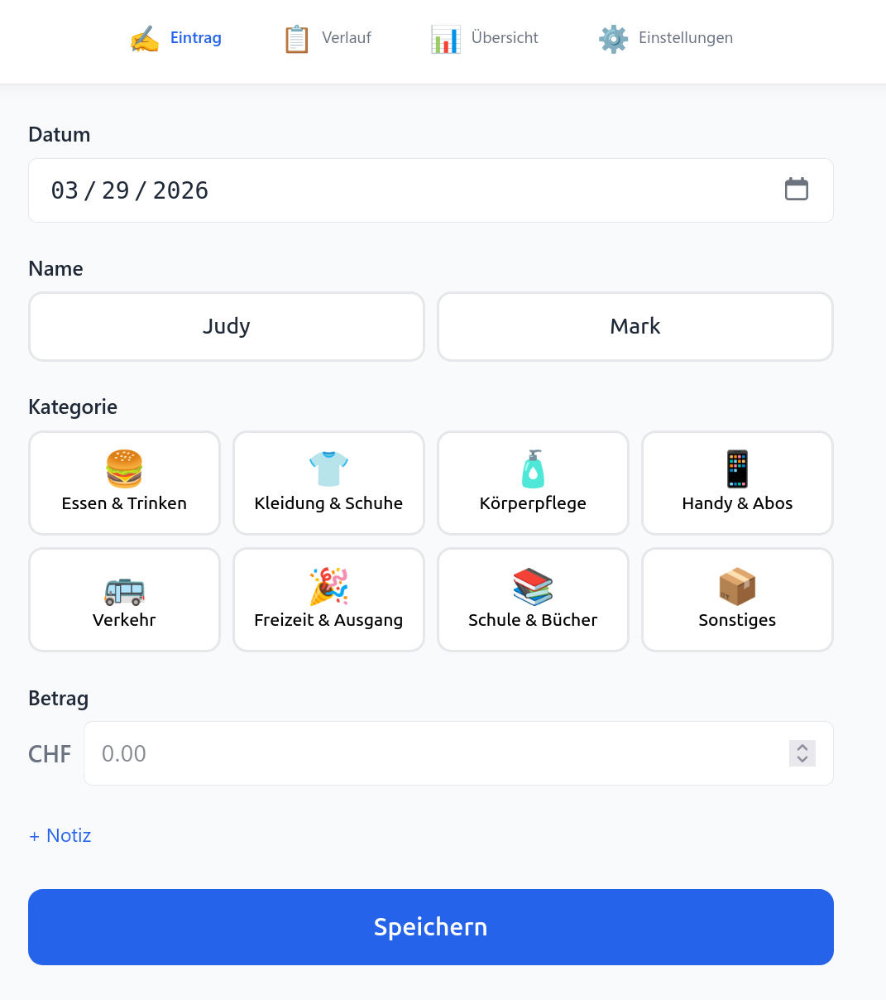
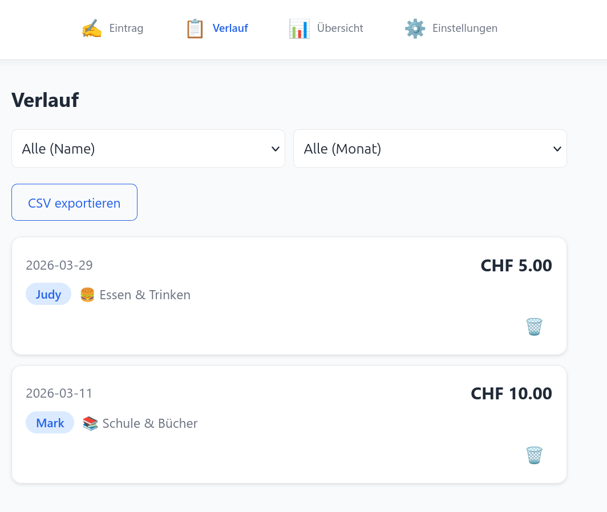
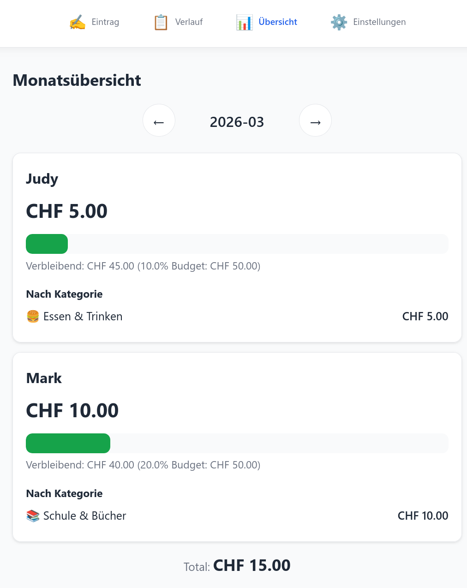
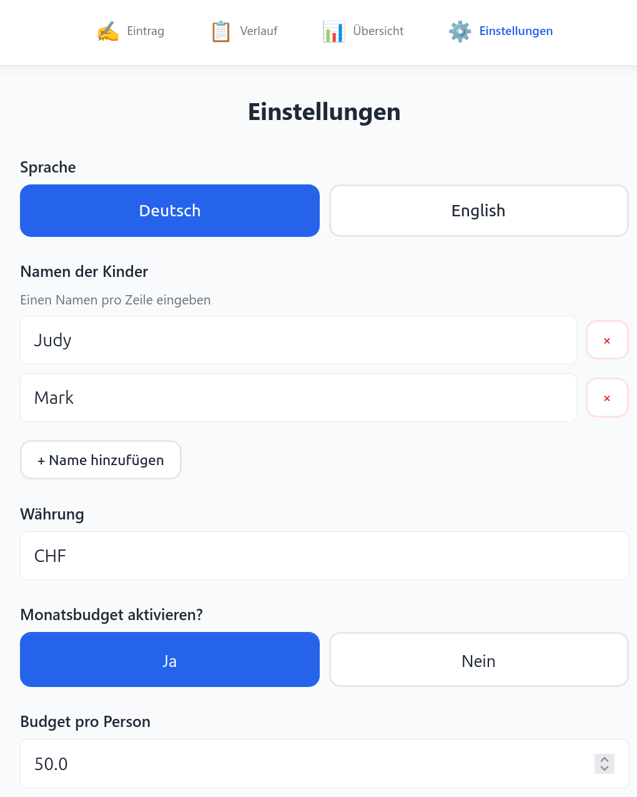
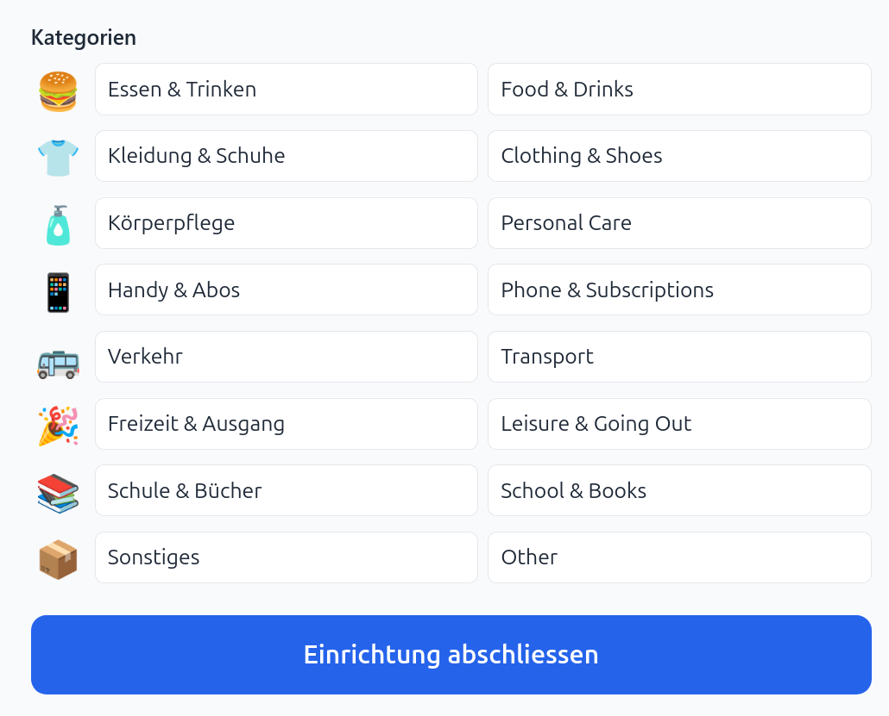

# Jugendlohn Tracker

A lightweight Flask web app for tracking youth allowance spending. Server-rendered HTML, CSV/JSON storage, and a first-run setup wizard—no database or JavaScript build step required.

## Features

- Add expenses with date, name, category, amount, and notes; delete and export to CSV
- Monthly summary per child and per category, with optional per-person budget tracking
- History view with name and month filters
- First-run setup wizard for names, currency, categories, and language (DE/EN); in-app language toggle
- Container-ready with a named Docker volume for data persistence and configurable port via `PORT`

## Quickstart (local)

```bash
python3 -m venv .venv
source .venv/bin/activate
pip install -r requirements.txt
python app.py
# Visit http://localhost:5000 and complete the setup wizard
```
The app writes data to `data/` by default. Override with `DATA_DIR=/path/to/data` if desired.

## Docker

```bash
docker-compose up --build
# Visits http://localhost:5000
# Data persists in the named Docker volume 'jugendlohn_data'
```

To use a custom port:
```bash
PORT=8080 docker-compose up --build
# Visit http://localhost:8080
```

Or add a `.env` file next to `docker-compose.yml`:
```
PORT=8080
```

## Configuration and data

- Config file: `data/config.json` (created by the setup wizard). Contains language, currency, child names, categories, and budget settings.
- Expenses: `data/expenses.csv` (created on first save), guarded by a threading lock.
- Environment variables:
  - `DATA_DIR`: directory for `config.json` and `expenses.csv` (default: `./data`).
  - `PORT`: server port (default: `5000`). Set via shell or `.env` file when using Docker.

Example `config.json`:
```json
{
  "language": "de",
  "currency": "CHF",
  "names": ["Alex", "Mia"],
  "budget_enabled": true,
  "budget_amount": 200,
  "categories": [
    {"key": "food", "icon": "burger", "de": "Essen & Trinken", "en": "Food & Drinks"},
    {"key": "other", "icon": "box", "de": "Sonstiges", "en": "Other"}
  ]
}
```

CSV schema (`data/expenses.csv`):

| column    | description                                  |
|-----------|----------------------------------------------|
| id        | `uuid4().hex[:8]`                            |
| timestamp | ISO 8601 datetime of entry                   |
| date      | `YYYY-MM-DD` expense date                    |
| name      | Child name                                   |
| category  | Category key                                 |
| amount    | Decimal string with two fractional digits    |
| note      | Optional note (formula-injection safe)       |

## Usage
- `GET /` — enter an expense
- `POST /api/expense` — submit an expense
- `GET /history` — list and filter; delete via `POST /api/delete/<id>`
- `GET /summary?month=YYYY-MM` — monthly totals per child and per category
- `GET /setup` — run or rerun the setup wizard
- `GET /api/export` — download `expenses.csv`
- `POST /api/lang/<de|en>` — switch UI language

## Testing

```bash
pytest -v
```

## Project layout

```
app.py              # Flask app, routes, CSV/config helpers, i18n
data/               # Persisted config and expenses (can be overridden via DATA_DIR)
docs/ARCHITECTURE.md# Deeper design notes and data flow diagrams
static/             # CSS, JS, manifest
templates/          # Jinja2 templates (entry, history, summary, setup)
tests/              # Pytest coverage for config, CSV ops, routes, summary
```

## What you can expect










## Notes

- Designed for home-network use; no authentication is implemented.
- Avoid concurrent writes outside the app to keep CSV integrity.
